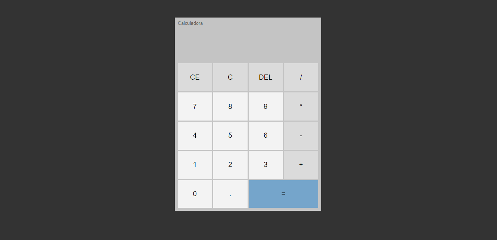

<h1>Calculadora em JavaScript.</h1>

Este é um projeto simples de calculadora criado utilizando JavaScript.

<h3>Linguagens e Ferramentas utilizadas no Projeto:</h3>

<h1>Funcionalidades</h1>
Adição (+)
Subtração (-)
Multiplicação (*)
Divisão (/)
Porcentagem (%)

